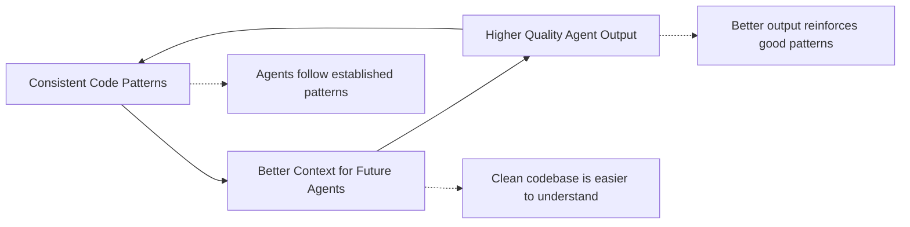

# LLM-Assisted Development Success Patterns
## A Language-Agnostic Guide to Building Projects with AI Coding Agents

*Based on the KotaDB case study: achieving exceptional development velocity and quality in 12 days of AI-assisted development*

## Executive Summary

This document outlines proven patterns that enable successful collaboration between human developers and LLM coding agents. These patterns create what we call a **"pit of success"** - where the easiest path for agents to follow is also the correct one, resulting in consistently high-quality output.

The key insight: **Systematic risk reduction combined with agent-optimized workflows creates a virtuous feedback cycle that amplifies both development velocity and code quality.**

## The Virtuous Feedback Cycle



**The Self-Reinforcing Loop**: When agents consistently produce well-structured code following established patterns, they create better context for future agents. This improved context makes it easier for subsequent agents to understand the system and produce even higher quality output, which reinforces the established patterns and continues the cycle.

**Key Insight**: Quality compounds over time. Each well-written piece of code makes the next piece easier to write correctly.

## Core Success Principles

### 1. The Pit of Success Architecture

**Principle**: Make it easier to write correct code than incorrect code.

**Implementation Patterns**:
- **Validated Types**: Prevent invalid construction at compile/runtime
- **Builder Patterns**: Fluent APIs guide correct usage
- **Factory Functions**: One-line access to production-ready components
- **Wrapper Composition**: Layer safety features automatically

**Example (Language Agnostic)**:
```
// Instead of raw constructors
Database db = new Database(path, options, cache, retry, validation);

// Provide factories that compose safety features
Database db = DatabaseFactory.createProduction(path);
```

### 2. Anti-Mock Testing Philosophy

**Principle**: Test with real implementations and failure injection, not mocks.

**Why This Works for LLMs**:
- Agents understand real systems better than abstract mocks
- Failure injection catches integration issues that unit tests miss
- Real implementations provide better context for debugging

**Implementation**:
- Create failure-injecting variants of real components
- Use temporary environments for isolation
- Test actual I/O operations, not simulated ones
- Implement chaos testing with real failure scenarios

### 3. GitHub-First Communication Protocol

**Principle**: Use version control platform as the primary communication medium between agents.

**Implementation**:
- **Structured Label Taxonomy**: Component, priority, effort, status labels
- **Issue-Driven Development**: Every feature maps to tracked issues
- **Agent Handoff Protocol**: Clear procedures for session transitions
- **Progressive Documentation**: Knowledge builds incrementally in issues/PRs

**Label System Example**:
```
Component: [backend, frontend, database, api]
Priority: [critical, high, medium, low]
Effort: [small <1d, medium 1-3d, large >3d]
Status: [needs-investigation, blocked, in-progress, ready-review]
```

### 4. Systematic Risk Reduction Methodology

**Principle**: Layer complementary risk-reduction strategies.

**The Six Stages** (adapted from KotaDB):
1. **Test-Driven Development** (-5.0 risk): Tests define expected behavior
2. **Contract-First Design** (-5.0 risk): Formal interfaces with validation
3. **Pure Function Modularization** (-3.5 risk): Side-effect-free business logic
4. **Comprehensive Observability** (-4.5 risk): Tracing, metrics, structured logging
5. **Adversarial Testing** (-0.5 risk): Chaos engineering and edge cases
6. **Component Library** (-1.0 risk): Reusable, composable building blocks

**Total Risk Reduction**: -19.5 points (99% theoretical success rate)

### 5. Multi-Layered Quality Gates

**Principle**: Automate quality enforcement to prevent regression.

**Three-Tier Protection Model**:
1. **Core Gates**: Format, lint, build, basic tests
2. **Quality Gates**: Integration tests, performance validation, security scans
3. **Production Gates**: Stress testing, memory safety, backwards compatibility

**Zero-Tolerance Policies**:
- No compiler warnings allowed
- All formatting rules enforced
- Security vulnerabilities block deployment
- Performance regression detection

### 6. Agent-Optimized Documentation Strategy

**Principle**: Minimize documentation dependency while maximizing agent autonomy.

**Key Strategies**:
- **Single Source of Truth Files**: One comprehensive guide (like CLAUDE.md)
- **Discovery-Friendly Structure**: Let agents explore and understand naturally
- **Progressive Knowledge Building**: Context builds through issues and commits
- **Self-Documenting Code**: Prefer clear naming over extensive comments

**What to Document**:
- Essential workflow commands
- Architectural decision rationale
- Quality requirements and standards
- Communication protocols

**What NOT to Document**:
- Implementation details (let agents discover)
- Exhaustive API references (code should be self-explanatory)
- Step-by-step tutorials (agents adapt better to principles)

## Implementation Checklist

### Repository Setup
- [ ] Implement strict branching strategy (Git Flow recommended)
- [ ] Set up comprehensive CI/CD with three-tier quality gates
- [ ] Create structured label taxonomy for issues
- [ ] Establish zero-tolerance policies for warnings/formatting

### Code Architecture
- [ ] Implement validated types for user inputs
- [ ] Create builder patterns for complex object construction
- [ ] Provide factory functions for production-ready components
- [ ] Design wrapper patterns for composable safety features

### Testing Strategy
- [ ] Adopt anti-mock philosophy with real implementations
- [ ] Implement failure injection for resilience testing
- [ ] Create comprehensive test categorization (unit, integration, stress, chaos)
- [ ] Set up property-based testing for algorithm validation

### Documentation and Communication
- [ ] Create single comprehensive agent instruction file
- [ ] Establish GitHub-first communication protocol
- [ ] Implement progressive knowledge building through issues
- [ ] Minimize documentation dependency

### Quality Assurance
- [ ] Set up automated formatting and linting
- [ ] Implement performance regression detection
- [ ] Create security scanning pipeline
- [ ] Establish backwards compatibility testing

## Measuring Success

### Development Velocity Metrics
- **Commit frequency**: >5 commits/day indicates healthy velocity
- **PR turnaround time**: <2 days suggests efficient review process
- **Feature completion rate**: Track issues closed vs. opened
- **Conventional commit compliance**: >85% indicates systematic approach

### Quality Metrics
- **CI failure rate**: <5% suggests robust quality gates
- **Post-release bug rate**: <1% indicates effective testing
- **Performance regression incidents**: Zero tolerance
- **Security vulnerability count**: Track and trend to zero

### Agent Collaboration Metrics
- **Context handoff success**: Measure agent session continuity
- **Pattern consistency**: Track adherence to established patterns
- **Discovery efficiency**: Time for new agents to become productive
- **Knowledge accumulation**: Growing issue/PR knowledge base

## Common Pitfalls to Avoid

### 1. Over-Documentation
- **Problem**: Extensive documentation that agents ignore or misunderstand
- **Solution**: Focus on principles and discoverable patterns

### 2. Traditional Mocking
- **Problem**: Abstract test doubles that don't reflect real system behavior
- **Solution**: Use real implementations with failure injection

### 3. Weak Quality Gates
- **Problem**: Warnings and style issues accumulate, degrading context quality
- **Solution**: Zero-tolerance policies enforced by automation

### 4. Ad-Hoc Communication
- **Problem**: Knowledge trapped in chat logs or temporary documents
- **Solution**: GitHub-first communication with persistent issues/PRs

### 5. Monolithic Architecture
- **Problem**: Large, tightly-coupled components difficult for agents to understand
- **Solution**: Component library with clear separation of concerns

## Advanced Patterns

### Self-Validating Systems
Implement "dogfooding" where the system tests itself:
- Use your own tools to analyze your codebase
- Run real workloads against your system
- Discover integration issues through actual usage

### Failure Injection Hierarchies
Create sophisticated failure scenarios:
- **Component Level**: Individual service failures
- **System Level**: Network partitions, resource exhaustion
- **Cascade Level**: Multi-component failure propagation
- **Byzantine Level**: Inconsistent and malicious behavior

### Progressive Context Building
Structure information flow for optimal agent learning:
- **Session 1**: Basic patterns and immediate tasks
- **Session 2**: Deeper architectural understanding
- **Session N**: Full system comprehension and complex modifications

## Language-Specific Adaptations

### Strongly Typed Languages (Rust, TypeScript, Haskell)
- Leverage type system for compile-time validation
- Use advanced type features (generics, traits, unions)
- Implement zero-cost abstractions

### Dynamically Typed Languages (Python, JavaScript, Ruby)
- Implement runtime validation systems
- Use linting and formatting tools aggressively
- Create comprehensive test suites

### Systems Languages (C, C++, Zig)
- Focus heavily on memory safety patterns
- Implement comprehensive testing for undefined behavior
- Use static analysis tools extensively

### JVM Languages (Java, Kotlin, Scala)
- Leverage ecosystem tooling (Maven, Gradle, SBT)
- Use annotation-based validation
- Implement comprehensive integration testing

## Conclusion

The success of LLM-assisted development depends on creating systematic approaches that amplify both human and AI capabilities. By implementing these patterns, teams can achieve:

- **10x Development Velocity**: Rapid feature development without quality compromise
- **99% Success Rate**: Systematic risk reduction through layered safety mechanisms
- **Autonomous Agent Operation**: Agents work independently while maintaining consistency
- **Continuous Quality Improvement**: Self-reinforcing cycles that improve over time

The key insight is that **structure enables creativity** - by providing clear patterns and safety mechanisms, we free agents to focus on solving problems rather than navigating complexity.

## References and Further Reading

- **KotaDB Case Study**: 12 days of development, 226+ commits, 42 test files, 91% conventional commit compliance
- **Git Flow Methodology**: Systematic branching for collaborative development
- **Pit of Success Pattern**: Microsoft .NET Framework design philosophy
- **Anti-Mock Testing**: Real implementations with failure injection
- **Six-Stage Risk Reduction**: Layered approach to software reliability

---

*This document is a living guide. Update it based on your experiences with LLM-assisted development. The patterns described here are proven but should be adapted to your specific context and constraints.*