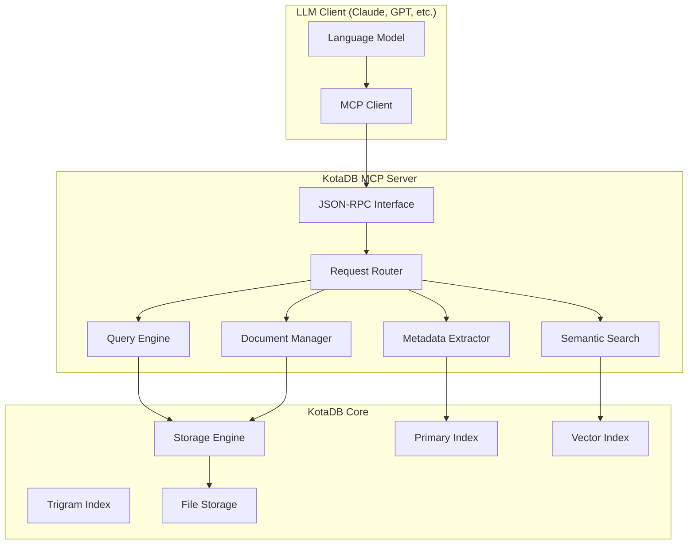

---
tags:
- file
- kota-db
- ext_md
---
# MCP Server Integration Plan - KotaDB

## Overview

This plan outlines the integration of KotaDB with the Model Context Protocol (MCP) to enable seamless LLM interaction with the knowledge database. The goal is to make KotaDB the premier database for AI-driven knowledge management and retrieval.

## MCP Server Architecture



## MCP Server Capabilities

### 1. Tools (Operations LLMs can perform)

#### Document Operations
- `kotadb://insert_document` - Add new documents to the database
- `kotadb://update_document` - Modify existing documents
- `kotadb://delete_document` - Remove documents
- `kotadb://get_document` - Retrieve document by ID or path

#### Search Operations
- `kotadb://semantic_search` - Find documents by meaning/concept
- `kotadb://text_search` - Full-text search with trigrams
- `kotadb://graph_search` - Traverse document relationships
- `kotadb://temporal_search` - Search by time ranges

#### Analysis Operations
- `kotadb://analyze_patterns` - Identify recurring themes
- `kotadb://extract_insights` - Generate insights from document corpus
- `kotadb://find_connections` - Discover relationships between documents
- `kotadb://summarize_collection` - Summarize groups of documents

### 2. Resources (Read-only access to database state)

#### Collections
- `kotadb://documents/` - Browse all documents
- `kotadb://tags/` - Browse available tags
- `kotadb://recent/` - Recently modified documents
- `kotadb://popular/` - Frequently accessed documents

#### Analytics
- `kotadb://metrics/` - Database performance metrics
- `kotadb://health/` - System health status
- `kotadb://schema/` - Database schema information

### 3. Prompts (Pre-configured interactions)

#### Knowledge Management
- `analyze_knowledge_gaps` - Identify missing information
- `suggest_related_content` - Recommend related documents
- `generate_summary` - Create document summaries
- `extract_action_items` - Find actionable items

## Implementation Phases

### Phase 1: Core MCP Server (Week 1-2)
**Goal**: Basic JSON-RPC server with essential document operations

**Deliverables**:
- `src/mcp/` - MCP server module
- `src/mcp/server.rs` - JSON-RPC server implementation
- `src/mcp/tools/` - Tool implementations
- `src/mcp/resources/` - Resource handlers
- Basic document CRUD operations via MCP

**Key Components**:
```rust
// src/mcp/server.rs
pub struct KotaDbMcpServer {
    storage: Arc<dyn Storage>,
    primary_index: Arc<dyn Index>,
    config: McpServerConfig,
}

// src/mcp/tools/document.rs
pub struct DocumentTools {
    storage: Arc<dyn Storage>,
}

impl DocumentTools {
    pub async fn insert_document(&self, args: InsertDocumentArgs) -> McpResult<DocumentResponse> { ... }
    pub async fn search_documents(&self, args: SearchArgs) -> McpResult<SearchResponse> { ... }
}
```

### Phase 2: Semantic Search Integration (Week 3)
**Goal**: Advanced semantic search capabilities

**Deliverables**:
- Vector embedding integration
- Semantic similarity search
- Concept-based document discovery
- Natural language query processing

**Key Features**:
- Convert natural language queries to semantic vectors
- Find conceptually similar documents
- Support for "find documents about X" queries
- Contextual search within document collections

### Phase 3: Graph Operations (Week 4)
**Goal**: Knowledge graph traversal and relationship discovery

**Deliverables**:
- Document relationship mapping
- Graph traversal tools
- Connection discovery algorithms
- Relationship strength scoring

**Key Features**:
- Follow citation chains and references
- Discover implicit connections between documents
- Map concept relationships across documents
- Generate knowledge graphs for visualization

### Phase 4: Advanced Analytics (Week 5-6)
**Goal**: AI-powered insights and pattern recognition

**Deliverables**:
- Pattern detection algorithms
- Insight generation tools
- Trend analysis capabilities
- Knowledge gap identification

**Key Features**:
- Identify recurring themes and patterns
- Generate insights from document corpus
- Track knowledge evolution over time
- Suggest areas for knowledge expansion

## Technical Implementation Details

### JSON-RPC Protocol Implementation

```rust
// src/mcp/protocol.rs
#[derive(Debug, Serialize, Deserialize)]
pub struct McpRequest {
    pub jsonrpc: String,
    pub id: Option<Value>,
    pub method: String,
    pub params: Option<Value>,
}

#[derive(Debug, Serialize, Deserialize)]
pub struct McpResponse {
    pub jsonrpc: String,
    pub id: Option<Value>,
    pub result: Option<Value>,
    pub error: Option<McpError>,
}

// Tool implementations
#[async_trait]
pub trait McpTool {
    async fn execute(&self, params: Value) -> McpResult<Value>;
    fn schema(&self) -> ToolSchema;
}
```

### Configuration System

```toml
# kotadb-mcp.toml
[server]
host = "localhost"
port = 8080
max_connections = 100
timeout_seconds = 30

[features]
semantic_search = true
graph_operations = true
analytics = true
real_time_updates = false

[limits]
max_results_per_query = 1000
max_query_complexity = 10
rate_limit_per_minute = 60

[storage]
cache_size_mb = 512
index_memory_limit_mb = 1024
```

### Error Handling

```rust
// src/mcp/error.rs
#[derive(Debug, thiserror::Error)]
pub enum McpError {
    #[error("Parse error: {0}")]
    ParseError(String),
    
    #[error("Invalid request: {0}")]
    InvalidRequest(String),
    
    #[error("Method not found: {0}")]
    MethodNotFound(String),
    
    #[error("Storage error: {0}")]
    StorageError(#[from] anyhow::Error),
    
    #[error("Query timeout")]
    Timeout,
}
```

## Integration Examples

### Basic Document Search
```json
{
    "jsonrpc": "2.0",
    "id": 1,
    "method": "tools/call",
    "params": {
        "name": "kotadb://semantic_search",
        "arguments": {
            "query": "machine learning algorithms for natural language processing",
            "limit": 10,
            "include_metadata": true
        }
    }
}
```

### Response
```json
{
    "jsonrpc": "2.0",
    "id": 1,
    "result": {
        "content": [
            {
                "type": "text",
                "text": "Found 8 documents related to machine learning algorithms for NLP"
            }
        ],
        "documents": [
            {
                "id": "doc_123",
                "path": "/ml/transformers.md",
                "title": "Transformer Architecture for NLP",
                "relevance_score": 0.94,
                "summary": "Comprehensive overview of transformer models..."
            }
        ]
    }
}
```

### Knowledge Graph Exploration
```json
{
    "jsonrpc": "2.0",
    "id": 2,
    "method": "tools/call",
    "params": {
        "name": "kotadb://graph_search",
        "arguments": {
            "start_document": "/projects/ai-research.md",
            "relationship_types": ["references", "related_to"],
            "max_depth": 3,
            "min_relevance": 0.7
        }
    }
}
```

## Performance Considerations

### Caching Strategy
- Cache semantic embeddings for frequently accessed documents
- LRU cache for search results
- Pre-compute popular query patterns
- Background index warming

### Query Optimization
- Index semantic vectors for sub-10ms lookup
- Batch similar queries for efficiency
- Implement query result streaming for large datasets
- Use approximate algorithms for real-time responses

### Scalability Features
- Horizontal scaling support for multiple MCP server instances
- Load balancing for high-throughput scenarios
- Connection pooling for database access
- Background processing for complex analytics

## Security & Privacy

### Authentication
- API key-based authentication for MCP clients
- Rate limiting per client
- Audit logging of all operations
- Encrypted connections (TLS)

### Data Privacy
- Local-only operation (no cloud dependencies)
- Configurable data retention policies
- Secure document deletion with overwriting
- Access control for sensitive documents

## Testing Strategy

### Unit Tests
- Individual tool implementations
- Protocol serialization/deserialization
- Error handling scenarios
- Performance benchmarks

### Integration Tests
- End-to-end MCP client-server communication
- Multi-document operations
- Concurrent access patterns
- Failure recovery scenarios

### Performance Tests
- Query latency under load
- Memory usage during large operations
- Concurrent client handling
- Cache effectiveness metrics

## Deployment Options

### Standalone Server
```bash
# Start MCP server
kotadb mcp-server --config kotadb-mcp.toml --data-dir ./data

# Connect from LLM client
export KOTADB_MCP_URL="http://localhost:8080"
```

### Embedded Mode
```rust
// Embed in larger application
use kotadb::mcp::KotaDbMcpServer;

let server = KotaDbMcpServer::new(storage, config).await?;
server.serve_on_port(8080).await?;
```

### Docker Deployment
```yaml
# docker-compose.yml
version: '3.8'
services:
  kotadb-mcp:
    image: ghcr.io/jayminwest/kota-db:latest
    command: ["mcp-server", "--config", "/config/kotadb-mcp.toml"]
    ports:
      - "8080:8080"
    volumes:
      - ./data:/data
      - ./config:/config
```

## Success Metrics

### Functional Goals
- [ ] Support all core MCP protocol features
- [ ] <10ms response time for simple queries
- [ ] <100ms response time for semantic searches
- [ ] 99.9% uptime under normal load
- [ ] Handle 1000+ concurrent connections

### Quality Goals
- [ ] 100% test coverage for MCP components
- [ ] Comprehensive error handling
- [ ] Production-ready logging and monitoring
- [ ] Security audit compliance
- [ ] Documentation for all public APIs

### Integration Goals
- [ ] Compatible with major LLM providers (OpenAI, Anthropic, etc.)
- [ ] Seamless integration with existing knowledge management workflows
- [ ] Support for popular MCP client libraries
- [ ] Example integrations with VSCode, Jupyter, etc.

---

**Next Steps**:
1. Implement basic MCP server framework
2. Add core document operations
3. Integrate semantic search capabilities
4. Build comprehensive test suite
5. Create deployment documentation
6. Develop example client integrations

This MCP integration will make KotaDB the go-to database for LLM-powered knowledge management and retrieval systems.
